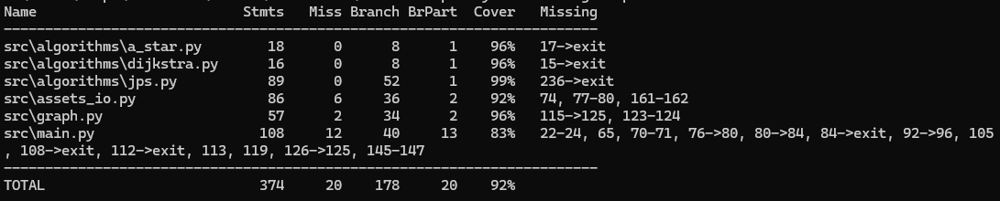

# Testausdokumentti

## Mitä on testattu
Ohjelmistossa on neljä testauksen kohdetta: algoritmit, tietorakenteet, syötteiden käsittely ja pääohjelma. Testit on tehty käyttäen Unittest-kehystä ja testit suorittavat yksikkötestausta yksittäisille toiminnoille, integraatio testausta kokonaisuuksille ja pääohjelman tapauksessa päästä päähän -testausta. Repositoriossa on käytössä GitHub actions, jolla nämä testit ajetaan pilvi-ympäristössä aina kun src-hakemistoa muokataan. Testauksen ulkopuolelle on jätetty käyttöliittymä, joka tässä tapauksessa on ainoastaan komentorivi syötteiden luku ja tulostus pääohjelmassa.

## Testikattavuus

Visuaalisen esityksen testikattavuudesta voi nähdä myös CodeCov:sta: 

## Testisyötteet
JPS algoritmin funktioiden testaamisessa on käytetty syötteinä julkaisussa esitettyjä tilanteita, jotka määrittävät algoritmin naapureiden karsimissääntöjä, pakotettuja naapureita ja hyppypisteitä.
<!--#L9-#L50-->
https://github.com/Wincewind/tiralabra/blob/b4534c2b2f02d3f5081d185cd1cd466094433ef3/src/tests/algorithms_test.py#L9-L50
Näillä on yleensä jokin määriteltävä lukumäärä, johon algoritmin tulosta voidaan verrata. Polunetsinnän tulosten varmistamisessa on määritetty pieniä verkkoja, joille on lyhyin polku pystytty laskemaan käsin. Testeistä on eri versioita esim. tilanteille missä kulmien leikkaus on sallittua ja missä ei. Algoritmien toteutusten oikeellisuutta on myös testattu vertaamalla niitten tuloksia toisiinsa.
<!--#L46-#L59-->
https://github.com/Wincewind/tiralabra/blob/b4534c2b2f02d3f5081d185cd1cd466094433ef3/src/tests/assets_service_test.py#L46-L59
Verkon muodostuksessa, syötteiden käsittelyssä ja näiden integraatiotestauksessa hyödynnetään Moving AI Labin karttoja ja skenaarioita. Näitä on myös hyödynnetty algoritmien laajemmassa testauksessa, missä algoritmin löytämän polun pituutta verrataan skenaariossa määritettyyn. Pidemmillä poluilla tulee kuitenkin huomattava määrä pyöristyseroa odotetun tuloksen ja algoritmin välillä, joten näitä testejä suoritetaan rajallinen määrä.

## Testien suorittaminen
Testejä voidaan suorittaa lokaalisti ja näistä testikattavuus raportin voi generoida [README.md ohjeiden](https://github.com/Wincewind/tiralabra?tab=readme-ov-file#testikattavuus) avulla.

Algoritmien testausta voi nyt myös suorittaa pääohjelmalla käyttäen komentorivi-argumentteja Ohjeet näiden käyttöön löytyy [README:stä](https://github.com/Wincewind/tiralabra/tree/main?tab=readme-ov-file#p%C3%A4%C3%A4ohjelman-k%C3%A4ynnist%C3%A4minen-komentorivi-argumenteilla).
