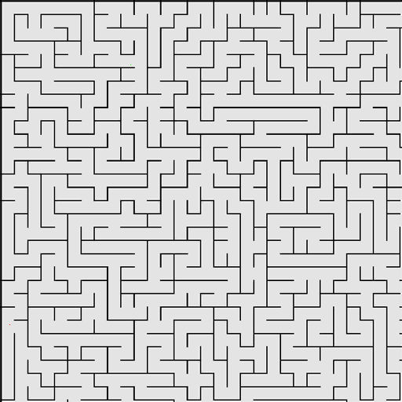

# Viikkoraportti, viikko 2
Kehitin alustavia tietorakenteita ja algoritmeja. Päätin olla aloittamatta vielä tällä viikolla JPS algoritmin kehitystä ja saatuani Dijkstran algoritmin lisättyä, keskityin toiminnallisuuteen, jolla hallinnoidaan Moving AI Labin resursseja. Tällä tavoin pääsen testaamaan algoritmeja monipuolissti mahdollisiman pian. Toiminnallisuuksien päästä päähän testaamiseksi, päätin kehittää myös alustavan pääohjelman, jossa konsolilla voidaan valita yksittäinen skenaario tai usea satunnainen ajettavaksi.

Dijkstran algoritmi oli aiemmilta kursseilta tuttu, joten tämän implementointi ei tuottanut ongelmia. Olin aiemmalla viikolla jo hieman perehtynyt Moving AI Labin materiaalien formaattiin ja ideoinut tämän käsittelyä passiivisesti, joten en kohdannut suurempia haasteita tätä kehittäessäni.

Testasin animaation tuottamista Pillow kirjaston toiminnallisuuksilla ja oikean kuvataajuuden aikaansaamiseksi näyttäisi ainakin Dijkstralla, että tilanne käsitellyistä solmuista kannattaa piirtää "skenaarion minimipituus / 2"-kierroksella. Mietin tilanteen piirtämisen tarkemmin myöhemmillä viikoilla, joten en nyt toistaiseksi lisää ohjelmakoodiin mitään ja keskityn tyytymään lopullisten solmujen värittämiseen suorituksen päätyttyä. Jos kuitenkin tarvitsen JPS kehityksessä/testauksessa enemmän visuaalista apua, on hyvä tietää että animaation tuottaminen ei ole kovin vaativaa.

Ensi viikolla keskityn saamaan JPS implementoitua ja tehtyä tälle yksikkötestejä. Dokumentaation osalta varmistan, että Testausdokumentti on aloitettu.

## Tuntikirjanpito

| Päivä | Käytetty aika | Kuvaus |
| ----- | ------------- | ------ |
| 19.3.  | 4h | Kehitetty verkkolle ja solmuille omat luokat ja näille lyhyitä testejä |
| 20.3.  | 2h | Implementoitu Dijkstran algoritmi ja täydennetty verkko luokan toteutusta |
| 20.3.  | 3,5h | Lisätty IO käsittely ja testejä Moving AI Labin kartta resursseille |
| 21.3.  | 4h | Täydennetty testausta ja lisätty alustava pääohjelma algoritmien ja skenaario resurssien käsittelyyn |
| 21.3.  | 0,5h | Testattu animaation tuottamista Pillow-kirjastolla |
| Total  | 14h |  |
